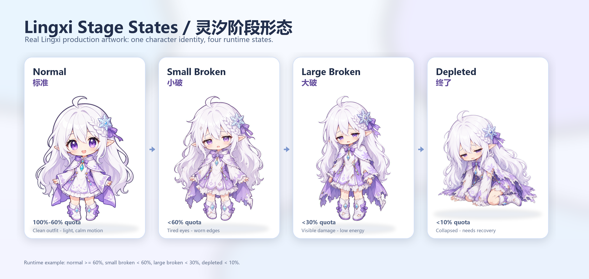

# Codex Pet Workflow / Codex 宠物制作流程

A Codex skill for turning a suitable character image into an animated Codex pet.

这是一个用于“把合适的角色图像制作成 Codex 动态宠物”的 Codex skill。它不是只服务某一个角色，而是沉淀了一套通用流程：先确认角色形象，再制作动画图集，最后接入 Codex 运行时。

## What This Skill Does

`codex-pet-workflow` helps Codex plan and execute a pet-making workflow from an arbitrary mascot, avatar, generated character, or reference image.

It focuses on:

- Character intake and identity confirmation before animation.
- Standard Codex pet atlas production.
- State variants such as normal, tired, damaged, and depleted.
- QA for frame leaks, wrong directions, scale drift, and stale runtime assets.
- Native Codex pet installation, sidecar rendering, renderer hooks, and hot-switching checks.
- The Lingxi pet as a worked example.

## 这个 Skill 做什么

`codex-pet-workflow` 用来指导 Codex 从任意合适的角色图像开始，完成一个可安装、可验证、可扩展的 Codex pet。

它重点解决：

- 在制作完整动画前，先确认初始角色形象是否正确。
- 制作标准 Codex pet 图集。
- 设计标准、小破、大破、终了等阶段形态。
- 检查边缘串格、左右方向错误、比例漂移、运行时缓存未更新等问题。
- 区分原生 Codex pet、sidecar 渲染、renderer hook 和热切换。
- 以“灵汐”作为完整案例，保留我们实际制作时踩过的坑。

## Install

Codex discovers local skills from:

- `$CODEX_HOME/skills`, when `CODEX_HOME` is set.
- `%USERPROFILE%\.codex\skills`, on Windows when `CODEX_HOME` is not set.

Copy the skill folder itself, not the whole repository. The installed path should end with:

```text
<skills-root>/codex-pet-workflow/SKILL.md
```

PowerShell:

```powershell
git clone git@github.com:wzl-xenon/codex-pet-workflow.git
cd codex-pet-workflow

$skillsRoot = if ($env:CODEX_HOME) {
  Join-Path $env:CODEX_HOME "skills"
} else {
  Join-Path $env:USERPROFILE ".codex\skills"
}

$target = Join-Path $skillsRoot "codex-pet-workflow"
New-Item -ItemType Directory -Force $target | Out-Null
Copy-Item -Recurse -Force ".\skills\codex-pet-workflow\*" $target

Test-Path (Join-Path $target "SKILL.md")
```

The final command should print `True`. Start a new Codex thread or restart Codex if the skill list does not refresh automatically.

## 安装

Codex 会从以下目录发现本地 skills：

- 设置了 `CODEX_HOME` 时：`$CODEX_HOME/skills`
- Windows 默认路径：`%USERPROFILE%\.codex\skills`

注意：复制的是 skill 文件夹本身，不是整个仓库。安装后应该能看到：

```text
<skills-root>/codex-pet-workflow/SKILL.md
```

PowerShell：

```powershell
git clone git@github.com:wzl-xenon/codex-pet-workflow.git
cd codex-pet-workflow

$skillsRoot = if ($env:CODEX_HOME) {
  Join-Path $env:CODEX_HOME "skills"
} else {
  Join-Path $env:USERPROFILE ".codex\skills"
}

$target = Join-Path $skillsRoot "codex-pet-workflow"
New-Item -ItemType Directory -Force $target | Out-Null
Copy-Item -Recurse -Force ".\skills\codex-pet-workflow\*" $target

Test-Path (Join-Path $target "SKILL.md")
```

最后一行应该输出 `True`。如果当前 Codex 没有立刻识别新 skill，开一个新线程或重启 Codex。

## Usage

Use the skill when asking Codex to make, repair, extend, or install a pet:

```text
Use $codex-pet-workflow with this character image. First confirm the character identity, then plan the Codex pet atlas and install path.
```

For Lingxi-specific work:

```text
Use $codex-pet-workflow and the Lingxi example to add a depleted state.
```

## Lingxi Stage Diagram / 灵汐阶段图示意



This high-resolution diagram uses real Lingxi production artwork. It is not the final pet atlas; it shows how one character identity can move through runtime states while preserving the same visual anchors.

这张高清图使用真实灵汐制作素材。它不是最终 pet 图集，而是展示同一个角色如何在保持身份锚点的前提下，随运行状态进入标准、小破、大破和终了。

## 使用方式

当你需要制作、修复、扩展或安装 pet 时，可以这样说：

```text
使用 $codex-pet-workflow，参考这张角色图。先确认角色形象，再规划 Codex pet 图集和安装路径。
```

如果是灵汐相关任务：

```text
使用 $codex-pet-workflow，并参考灵汐案例，补一个终了状态。
```

## Workflow

1. Character intake: extract visual anchors from the source image.
2. Confirmation gate: make or inspect a still preview and confirm the character identity.
3. Normal form: build the standard pet atlas first.
4. State variants: add tired, damaged, depleted, or custom forms.
5. Runtime integration: decide between native pet loading, sidecar rendering, or renderer hooks.
6. QA and install: validate the atlas, package `pet.json`, install, and verify behavior.

## 流程

1. 角色输入：从参考图提取角色锚点。
2. 形象确认：先做静态预览或首帧确认，确认“这还是不是原角色”。
3. 标准形态：优先完成标准 pet 图集。
4. 阶段形态：再制作疲惫、小破、大破、终了或其他自定义状态。
5. 运行时接入：判断使用原生加载、sidecar 渲染，还是 renderer hook。
6. QA 与安装：检查图集、打包 `pet.json`、安装并验证真实运行效果。

## Repository Layout

```text
skills/
  codex-pet-workflow/
    SKILL.md
    agents/openai.yaml
    references/
      character-intake.md
      production-stages.md
      runtime-integration.md
      lingxi-case.zh.md
```

## 语言说明

The skill metadata and core workflow are written mostly in English so Codex can trigger and reuse the skill reliably. Chinese reference documents are included when they carry project-specific nuance.

skill 的元信息和核心流程以英文为主，方便 Codex 检索和触发；中文内容放在参考文档里，适合记录我们自己的制作经验、灵汐案例、Windows/PowerShell 中文编码注意事项。

## Notes

- This repository contains the workflow skill, not a full pet asset pack.
- Existing pet files, backups, and renderer patches should not be deleted unless the user explicitly approves it.
- Hot switching should only be claimed after the currently running Codex renderer visibly reacts without a restart.

## 注意事项

- 这个仓库保存的是制作流程 skill，不是完整宠物素材包。
- 除非用户明确允许，不应该删除已有 pet、备份或 renderer patch。
- 只有当前运行中的 Codex 渲染器在不重启的情况下响应了变化，才应该说“热切换成功”。
